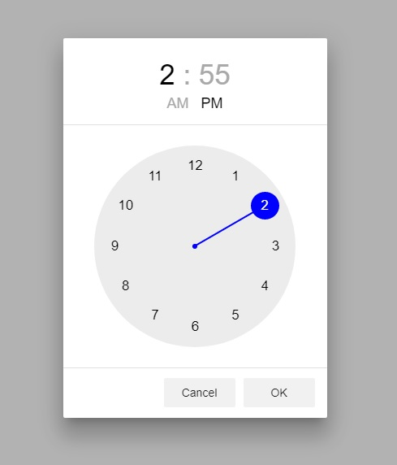

# Amazing Time Picker (Clock) 
This is time picker for angular projects, for Angular Material 4.

A visual time picker for angular 2+ projects. You can use this timepicker with Angular 2, 4 and Angular Material.

## Install
You need to install this repository as dependency and import it to your `app.module.ts` in `imports` section.

```
npm install amazing-time-picker --save
```

then, open your `app.module.ts` or other module that you want to use timepicker among, and import and add it to the `imports` section:

```
import { BrowserModule } from '@angular/platform-browser';
import { NgModule } from '@angular/core';
import { AmazingTimePickerModule } from 'amazing-time-picker'; // this line you need
import { AppComponent } from './app.component';

@NgModule({
  declarations: [
    AppComponent
  ],
  imports: [
    BrowserModule,
    AmazingTimePickerModule // this line you need
  ],
  providers: [],
  bootstrap: [AppComponent]
})
export class AppModule { }
```

This helps your angular project to build and compile it and let you use it.

## Using in component markup
After you have installed this module, you can use it within your html templates and give the directive to the any <input> tag. When user closes the dialog, it's gonna update the input value and will listen to input click event to open the dialog.

```html
<input atp-time-picker value="19:00"></input>
```

## Opening component programmatically
You can also open a timepicker dialog programmatically. In order to open that, you need to import the service in your component:

```
import { AmazingTimePickerService } from 'amazing-time-picker';
```

Then add it inside your `app.component.ts` or any other component that you want to use timepicker inside of that.

```
import { Component } from '@angular/core';
import { AmazingTimePickerService } from 'amazing-time-picker'; // this line you need

@Component({
  selector: 'app-root',
  templateUrl: './app.component.html',
  styleUrls: ['./app.component.scss']
})
export class AppComponent {
  
  constructor( private atp: AmazingTimePickerService, // this line you need
             ) { }

  open() {
    const amazingTimePicker = this.atp.open();
    amazingTimePicker.afterClose().subscribe(time => {
      console.log(time);
    });
  }
}
```


Online demo



https://owsolutions.github.io/amazing-time-picker/
